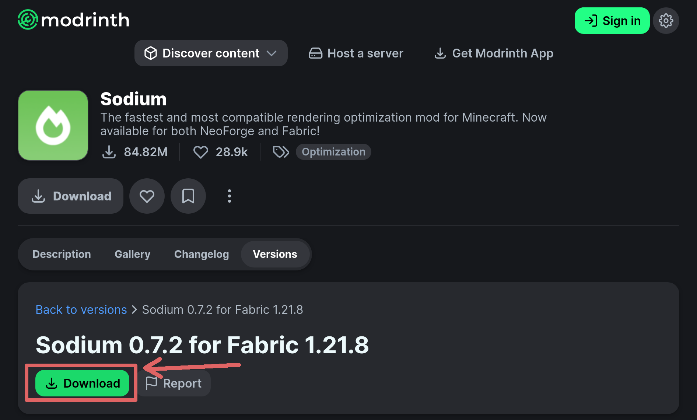
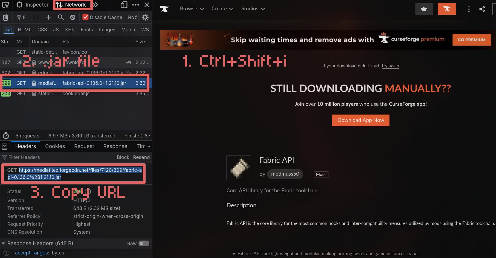

# Simple Mod Sync - User Guide

**Table of contents**
<!--toc:start-->
- [Simple Mod Sync - User Guide](#simple-mod-sync-user-guide)
  - [Quick Start Guide](#quick-start-guide)
    - [Step 1: Create Your Sync File](#step-1-create-your-sync-file)
    - [Step 2: Add Your First Mod](#step-2-add-your-first-mod)
    - [Step 3: Add More Content](#step-3-add-more-content)
    - [Step 4: Share Your File](#step-4-share-your-file)
  - [Understanding the Sync File](#understanding-the-sync-file)
    - [The Basics](#the-basics)
    - [Making Content Updatable](#making-content-updatable)
  - [Different Types of Content](#different-types-of-content)
    - [Mods](#mods)
    - [Resource Packs](#resource-packs)
    - [Shaders](#shaders)
    - [Data Packs](#data-packs)
    - [Config Files (Packed Content)](#config-files-packed-content)
  - [Getting Download Links](#getting-download-links)
    - [From Modrinth](#from-modrinth)
    - [From CurseForge](#from-curseforge)
    - [From Other Sources](#from-other-sources)
  - [Complete Example](#complete-example)
  - [Tips and Troubleshooting](#tips-and-troubleshooting)
  - [Glossary](#glossary)
  - [Advanced Features](#advanced-features)
    - [File Modifications](#file-modifications)
    - [Remove Files](#remove-files)
    - [Rename/Move Files](#renamemove-files)
<!--toc:end-->

---

## Quick Start Guide

### Step 1: Create Your Sync File

Open any text editor (Notepad, TextEdit, etc.) and paste this template:

```json
{
  "sync_version": 3,
  "sync": [

  ]
}
```

Save it as `modpack.json` (or any name ending in `.json`).

**What this means:**
- `sync_version: 3` tells Simple Mod Sync which format you're using (3 is the newest)
- `sync: [ ]` is where you'll put your list of content to download

### Step 2: Add Your First Mod

Let's add Sodium as an example. Between the square brackets `[ ]`, add:

```json
{
  "sync_version": 3,
  "sync": [
    {
      "url": "https://cdn.modrinth.com/data/AANobbMI/versions/EoNKHoLH/sodium-fabric-0.6.5%2Bmc1.21.1.jar",
      "name": "Sodium",
      "version": "0.6.5",
      "type": "mod"
    }
  ]
}
```

> Note that the URL is only as example, look at [From Modrinth](#from-modrinth) to get
> your own URL.

**What each part means:**
- `url` - Where to download the file from
- `name` - A friendly name so you know what this is
- `version` - Any text that helps you track which version this is
- `type` - What kind of content this is (mod, resourcepack, shader, etc.)

### Step 3: Add More Content

To add more items, put a comma `,` after the closing `}` and add another item:

```json
{
  "sync_version": 3,
  "sync": [
    {
      "url": "https://cdn.modrinth.com/data/AANobbMI/versions/EoNKHoLH/sodium-fabric-0.6.5%2Bmc1.21.1.jar",
      "name": "Sodium",
      "version": "0.6.5",
      "type": "mod"
    },
    {
      "url": "https://cdn.modrinth.com/data/P7dR8mSH/versions/4OZL6q6h/fabric-api-0.110.5%2B1.21.1.jar",
      "name": "Fabric API",
      "version": "0.110.5",
      "type": "mod"
    }
  ]
}
```

**Important:** Don't forget the comma between items! The last item should NOT have a comma after it.

### Step 4: Share Your File

1. Upload your `.json` file to a sharing service:
   - **Pastebin**: Go to pastebin.com, paste your file, save, and use the "raw" link
   - **GitHub Gist**: Create a gist at gist.github.com and use the "raw" link
   - **Your own website**: Upload it anywhere and link directly to the file

2. Make sure the link shows **only the text** (no website design around it)

3. Give this link to your friends - they'll paste it into Simple Mod Sync and everything downloads automatically!

---

## Understanding the Sync File

### The Basics

Every item in your sync list needs at minimum:
- **url** - The download link

Optional but recommended:
- **name** - Helps you remember what this is
- **version** - Helps track updates
- **type** - Where to put the file (defaults to "mod")

### Making Content Updatable

The `version` field is important for updates. When you want to update a mod:

1. Change the `url` to the new version's download link
2. Change the `version` to something different (any text works)
3. Users running the sync will automatically get the new version

**Example:**
```json
{
  "url": "https://example.com/sodium-0.5.0.jar",
  "version": "0.5.0",
  "name": "Sodium"
}
```

When you update:
```json
{
  "url": "https://example.com/sodium-0.6.0.jar",
  "version": "0.6.0",
  "name": "Sodium"
}
```

Simple Mod Sync sees the version changed and downloads the new file!

---

## Different Types of Content

### Mods
```json
{
  "url": "https://example.com/cool-mod.jar",
  "name": "Cool Mod",
  "version": "1.0",
  "type": "mod"
}
```
Goes into your `mods` folder.

### Resource Packs
```json
{
  "url": "https://example.com/texture-pack.zip",
  "name": "Awesome Textures",
  "version": "2.1",
  "type": "resourcepack"
}
```
Goes into your `resourcepacks` folder.

### Shaders
```json
{
  "url": "https://example.com/shader.zip",
  "name": "Beautiful Shaders",
  "version": "1.5",
  "type": "shader"
}
```
Goes into your `shaderpacks` folder.

### Data Packs
```json
{
  "url": "https://example.com/datapack.zip",
  "name": "Custom Worldgen",
  "version": "3.0",
  "type": "datapack"
}
```
Goes into your world's `datapacks` folder.

### Config Files (Packed Content)

For custom configurations or files that need to go in specific folders:

```json
{
  "url": "https://example.com/configs.zip",
  "name": "Modpack Configs",
  "version": "1.0",
  "type": "packed",
  "directory": "config"
}
```

This downloads a ZIP file and extracts it into the folder you specify with `directory`.

**Common uses:**
- `"directory": "config"` - Extract into the config folder
- `"directory": "config/somemod"` - Extract into a specific mod's config folder
- `"directory": "."` - Extract into the game directory root

You can also use `"type": "config"` instead of `"type": "packed"` - they work the same way.

---

## Getting Download Links

### From Modrinth



1. Go to the mod/pack page on Modrinth
2. Click the **Versions** tab
3. Find the version you want
4. **Right-click** the download button
5. Select "Copy link address" or "Copy link"
6. Paste this URL into your sync file

The URL should look like:
```
https://cdn.modrinth.com/data/PROJECT/versions/VERSION/filename.jar
```

**Important:** Make sure it ends with `.jar` or `.zip` - if it doesn't, you copied the wrong link!

### From CurseForge

Due to the way how CurseForge works, its not as easy to get the raw file URL. Either do it 
by inspecting the network when downloading the mod. 



Or follow this reddit post: https://www.reddit.com/r/feedthebeast/comments/fffna3/comment/fjyceu8/

The URL should look like:
```
https://mediafilez.forgecdn.net/files/XXXX/YYY/filename.jar
```

**Note:** Some CurseForge links may redirect or change. If you have issues, consider re-uploading the file to a more stable hosting service.

### From Other Sources

You can use any direct download link that:
- Points directly to a `.jar` or `.zip` file
- Doesn't require login or clicking through pages
- Is publicly accessible

**Good sources:**
- GitHub releases (use the "raw" download links)
- Direct file hosting services
- Your own web server

**Avoid:**
- Links that go to web pages (not the file itself)
- Download sites with ads/waiting timers
- Links that require accounts or authentication

---

## Complete Example

Here's a full sync file with different types of content:

```json
{
  "sync_version": 3,
  "sync": [
    {
      "url": "https://cdn.modrinth.com/data/AANobbMI/versions/EoNKHoLH/sodium-fabric-0.6.5%2Bmc1.21.1.jar",
      "name": "Sodium",
      "version": "0.6.5",
      "type": "mod"
    },
    {
      "url": "https://cdn.modrinth.com/data/P7dR8mSH/versions/4OZL6q6h/fabric-api-0.110.5%2B1.21.1.jar",
      "name": "Fabric API",
      "version": "0.110.5",
      "type": "mod"
    },
    {
      "url": "https://cdn.modrinth.com/data/slufHzC2/versions/Sdg6a6Tc/texture-pack.zip",
      "name": "Cool Textures",
      "version": "3.0",
      "type": "resourcepack"
    },
    {
      "url": "https://cdn.modrinth.com/data/BS9T99lD/versions/tAx0UOBX/shaders.zip",
      "name": "Amazing Shaders",
      "version": "0.12",
      "type": "shader"
    },
    {
      "url": "https://cdn.modrinth.com/data/lWDHr9jE/versions/aLQ1otmd/worldgen-pack.zip",
      "name": "Custom World Generation",
      "version": "2.4",
      "type": "datapack"
    },
    {
      "url": "https://example.com/modpack-configs.zip",
      "name": "Modpack Configuration",
      "version": "1.0",
      "type": "config",
      "directory": "config"
    }
  ]
}
```

---

## Tips and Troubleshooting

**✓ Always test your sync file** before sharing it! Run it yourself to make sure everything downloads correctly.

**✓ Keep version numbers updated** every time you change a URL. This ensures users get the new version.

**✓ Use clear names** so you and others know what each item is without checking the URL.

**✓ Check your commas!** Missing or extra commas are the most common mistake. Every item needs a comma after it except the last one.

**✓ Use a JSON validator** if something isn't working. Search "JSON validator" online and paste your file to check for errors.

**✗ Don't use shortened URLs** (like bit.ly) - use the full direct download link.

**✗ Don't include spaces or special characters** in version numbers unless necessary.

---

## Glossary

**Sync File / Schema File** - The `.json` file that contains your list of mods and content to download.

**JSON** - A file format for storing structured data. It's just text with specific formatting rules (like needing commas between items).

**URL** - The web address where a file can be downloaded from. Should point directly to a `.jar` or `.zip` file.

**Version** - A text label that helps track which version of a mod you're using. Change this when you update the URL.

**Type** - Tells Simple Mod Sync where to put the downloaded file (mods folder, resourcepacks folder, etc.).

**Packed Content** - A ZIP file that gets extracted into a specific folder you choose.

**Directory** - A folder path where packed content should be extracted to.

---

## Advanced Features

**Note:** This section is for advanced users who want more control over their Minecraft instance. Beginners can skip this entirely - the basic sync features above are all you need!

### File Modifications

The `modify` section lets you automatically remove or rename files in the game instance. This is useful for cleaning up old files or managing configurations.

**Structure:**
```json
{
  "sync_version": 3,
  "sync": [
    // ... your content here ...
  ],
  "modify": [
    // ... modifications here ...
  ]
}
```

Each modification needs:
- `type` - What operation to perform ("remove" or "rename")
- `pattern` - A regex pattern that matches files to modify
- `path` - Where to look for files (usually `"."` for the game directory)

**Warning:** Regex patterns can be complex. If you're not familiar with regex, use the examples below and test carefully!

### Remove Files

Automatically delete files matching a pattern.

**Example - Remove user cache:**
```json
{
  "sync_version": 3,
  "modify": [
    {
      "type": "remove",
      "pattern": "^usercache\\.json$",
      "path": "."
    }
  ]
}
```

This removes the `usercache.json` file from the game directory.

**Example - Remove old mod versions:**

This might be useful when you removed a mod from your modpack.

```json
{
  "type": "remove",
  "pattern": "^mods/oldmod-.*\\.jar$",
  "path": "."
}
```

This removes any file in the mods folder starting with "oldmod-" and ending with ".jar".

### Rename/Move Files

Move or rename files automatically.

**Example - Backup a file:**
```json
{
  "sync_version": 3,
  "modify": [
    {
      "type": "rename",
      "pattern": "^usercache\\.json$",
      "result": "usercache_backup.json",
      "path": "."
    }
  ]
}
```

This renames `usercache.json` to `usercache_backup.json`.

**Common Patterns:**

| What you want | Pattern |
|---------------|---------|
| Exact filename | `^filename\\.txt$` |
| Any file starting with "old" | `^old.*$` |
| Any .log file | `^.*\\.log$` |
| Files in config folder | `^config/.*$` |

**Important Notes:**
- Always use double backslashes `\\` before dots in filenames (e.g., `\\.json` not `.json`)
- Test your patterns carefully - they can match more files than you expect!
- The `result` in rename operations is the new filename or path
- You can test regex patterns at regex101.com before using them

**Full Example with Modifications:**
```json
{
  "sync_version": 3,
  "sync": [
    {
      "url": "https://cdn.modrinth.com/data/AANobbMI/versions/EoNKHoLH/sodium-fabric-0.6.5%2Bmc1.21.1.jar",
      "name": "Sodium",
      "version": "0.6.5",
      "type": "mod"
    }
  ],
  "modify": [
    {
      "type": "remove",
      "pattern": "^usercache\\.json$",
      "path": "."
    },
    {
      "type": "remove",
      "pattern": "^logs/.*\\.log$",
      "path": "."
    }
  ]
}
```

This sync file downloads Sodium and cleans up the user cache and old log files.

---

Note: This file was *improved* by Claude Sonnet 4.5 for better readability
